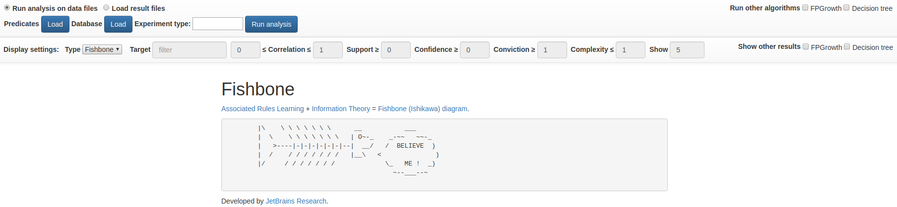
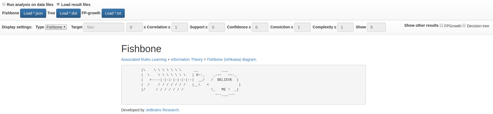

License 
Tests [/statusIcon.svg)](http://teamcity.jetbrains.com/viewType.html?buildTypeId=Biolabs_Fishbone&guest=1)

Fishbone: association rule mining using Ishikawa diagrams 
==============

# Project description

Fishbone project provides a service to automatically construct [Ishikawa diagrams](https://en.wikipedia.org/wiki/Ishikawa_diagram) for specified data files. A novel approach is used, which combines [Associated Rules](https://en.wikipedia.org/wiki/Association_rule_learning) learning technique and information theory.

Fishone is a client-server application with HTTP API and web UI. 

# Requirements
 - Java 1.8
 - Gradle >= 4.10

# Steps to run
## Build
To build application use the following Gradle  command:

    gradle build

To create jar file use:

    gradle shadowJar

## Run
To run application you can jar file using Java:

    java -Dgenomes.path=<path to empty folder to store genomes> -jar <service jar file> --port <port to run server; default: 8080> --output <path to output folder>

# Server API
## POST /rules
The endpoint is used to extract patterns from data files using different algorithms.
Request body (form-data):

    experiment : text; name of experiment to run on files (CIOFANI - experiment with files from Ciofani's article, CHIANTI - experiment with InChianti data files)
    predicates : file; files with predicates
    database : file; file with database
    miners : array of text; names of algorithms to use (supported: fishbone, fp-growth, tree)
    target : file, optional; file with target predicate

Returns (json):

    fishbone : path to result file for fishbone algorithm
    fp-growth : path to result file for fp-growth algorithm
    tree : path to result file for decision tree algorithm

## GET /rules?filename={file}
The endpoint to load result files.
Parameters:

    filename : full path to file

Returns:
file from specified path

# Web UI
Web UI consists of two main parts: running analysis and visualize results from local files.

To run analysis use the following part:

You should specify predicates files, database file and experiment type.

To load results use the following part:
 
 You can select local result files for different algorithms.