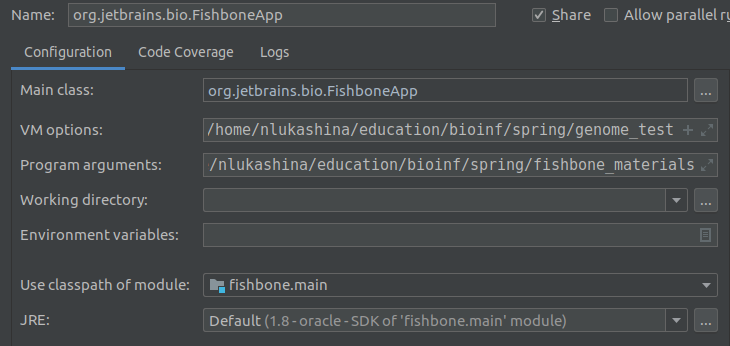
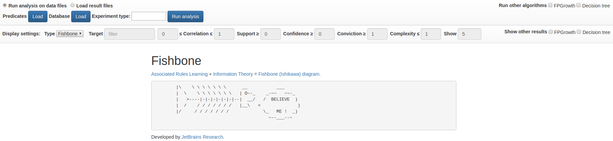
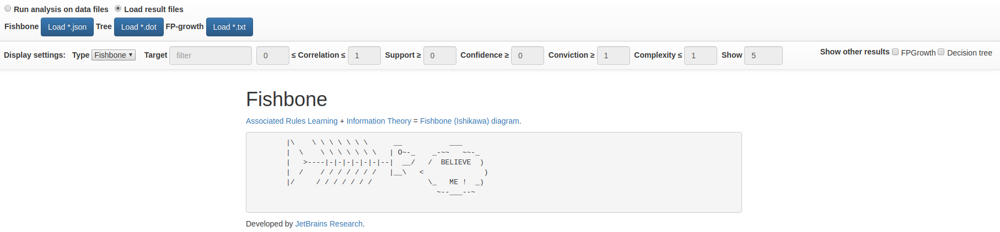

License 
Tests [/statusIcon.svg)](http://teamcity.jetbrains.com/viewType.html?buildTypeId=Biolabs_Fishbone&guest=1)

Fishbone: association rule mining using Ishikawa diagrams 
==============

# Project description

Fishbone project provides a service to automatically construct [Ishikawa diagrams](https://en.wikipedia.org/wiki/Ishikawa_diagram) for specified data files. A novel approach is used, which combines [Associated Rules](https://en.wikipedia.org/wiki/Association_rule_learning) learning technique and information theory.

Fishone is a client-server application with HTTP API and web UI. 

# Requirements
 - Java 1.8
 - Gradle >= 4.10
 - IntelliJ IDEA >= 2018

# Run
Clone repository files:

    git clone https://github.com/JetBrains-Research/fishbone.git
    
   
Import project as Gradle project in IntelliJ IDEA. (For details see: https://www.jetbrains.com/help/idea/gradle.html) 

To run service create run configuration in IntelliJ IDEA:
  
The following parameters must be specified:
- main class: org.jetbrains.bio.FishboneApp
- VM options: -Dgenomes.path={path_to_empty_folder_to_store_genomes}
- Program arguments: --port {port to run server; default: 8080} --output {path to output folder}

Use run configuration in Debug mode. 

# Server API
## POST /rules
The endpoint is used to extract patterns from data files using different algorithms.
Request body (form-data):

    experiment : (text); name of experiment to run on files (CIOFANI - experiment with files from Ciofani's article, CHIANTI - experiment with InChianti data files)
    predicates : (file); files with predicates
    database : (file); file with database
    miners : (array of text); names of algorithms to use (supported: fishbone, fp-growth, tree)
    target : (file, optional); file with target predicate

Returns (json):

    fishbone : (text); path to result file for fishbone algorithm
    fp-growth : (text); path to result file for fp-growth algorithm
    tree : (text); path to result file for decision tree algorithm

## GET /rules?filename={file}
The endpoint to load result files.
Parameters:

    filename : full path to file

Returns:
file from specified path

# Web UI
Web UI consists of two main parts: running analysis and visualize results from local files.

To run analysis use the following part:

Predicates files, database file and experiment type must be specified to run Fishbone algorithm. Checkboxes on the right side could be also used to run alternative algorithms.

To load results use the following part:
 
Local result files for different algorithms could be selected to visualize.