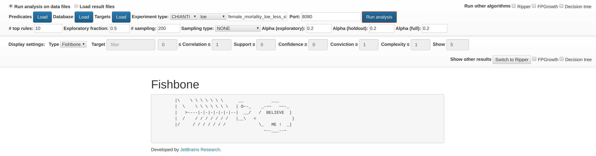
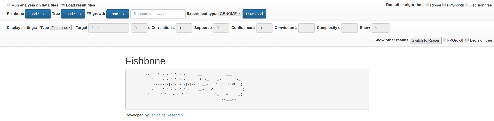
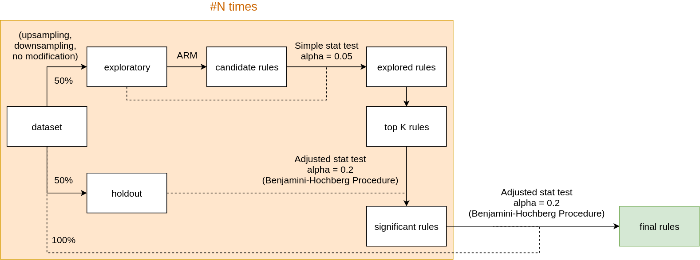

License [](https://opensource.org/licenses/MIT)
Tests [/statusIcon.svg)](http://teamcity.jetbrains.com/viewType.html?buildTypeId=Biolabs_Fishbone&guest=1)

Fishbone: association rule mining using Ishikawa diagrams
=========================================================

```
|\    \ \ \ \ \ \ \      __           ___
|  \    \ \ \ \ \ \ \   | O~-_    _-~~   ~~-_
|   >----|-|-|-|-|-|-|--|  __/   /  BELIEVE  )
|  /    / / / / / / /   |__\   <              )
|/     / / / / / / /             \_   ME !  _)
                                   ~--___--~
```

# Project description

Fishbone project provides a service to automatically
construct [Ishikawa diagrams](https://en.wikipedia.org/wiki/Ishikawa_diagram) for specified data files. A novel approach
is used, which combines [Associated Rules](https://en.wikipedia.org/wiki/Association_rule_learning)
learning technique and information theory.

Fishbone is a client-server application with HTTP API and web UI.

# Requirements

* Java 1.8
* Gradle >= 5.51

# Build

Clone repository files:

    git clone https://github.com/JetBrains-Research/fishbone.git

To build project use the following gradle command:

    ./gradlew shadowJar 

This command will create executable jar file with name

    build/libs/fishbone-{version}.build.jar

# Testing

In order to test service, use the following command from the project directory:

    ./gradlew test

This command will run all available kotlin tests.

# Run

To run service use the following command:

    java -Dgenomes.path={path_to_empty_folder_to_store_genomes} -jar build/libs/fishbone-{version}.build.jar

Optional program options are:

* `--port` {port to run server; default: 8080}
* `--output` {path to output folder}

# Usage

Web UI consists of two main parts: running analysis and visualize results from local files.

To run analysis use the following part:

Predicate files, database file, experiment type and objective function must be specified to run Fishbone algorithm.
Checkboxes on the right side could be also used to run alternative algorithms.

To load results use the following part:

Local result files for different algorithms could be selected to visualize.

# Service algorithms

This service implements a novel approach to mine association rules within specified data. <br/>
It also implements filtering of unproductive rules according to 'improvement'
metric [[1]](https://link.springer.com/article/10.1023/A:1009895914772) with corresponding significance check.
Significance check is done using holdout approach [[2]](https://link.springer.com/article/10.1007/s10994-007-5006-x).
<br/>
The following scheme represents rule mining workflow:

