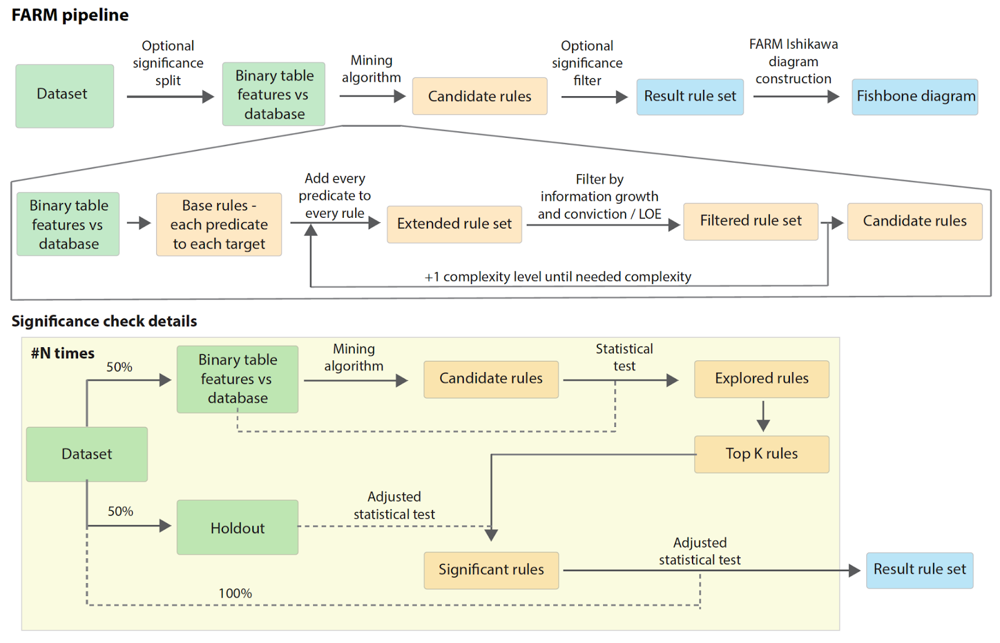

[](https://confluence.jetbrains.com/display/ALL/JetBrains+on+GitHub)
License [](https://opensource.org/licenses/MIT)
Tests [/statusIcon.svg)](http://teamcity.jetbrains.com/viewType.html?buildTypeId=Biolabs_Fishbone&guest=1)

```
|\    \ \ \ \ \ \ \      __           ___
|  \    \ \ \ \ \ \ \   | O~-_    _-~~   ~~-_
|   >----|-|-|-|-|-|-|--|  __/   /  BELIEVE  )
|  /    / / / / / / /   |__\   <              )
|/     / / / / / / /             \_   ME !  _)
                                   ~--___--~
```

Fishbone
========

Associations search is one of the methods of data
analysis. [Associated Rule Mining](https://en.wikipedia.org/wiki/Association_rule_learning) (ARM) approach can construct
association rules from observational data, but the most widely used algorithm Apriori typically produces a large number
of unstructured results without any ranking or statistical significance. We propose a novel method FARM (Fishbone
Association Rule Mining) to address these challenges. FARM is a method for hierarchical association rule construction
with significance filtering and a web-application for interactive visualisation and exploration of results. Hierarchical
rules are visualized in a form of Fishbone [Ishikawa diagrams](https://en.wikipedia.org/wiki/Ishikawa_diagram). Fishbone
is a client-server application for discovering and visualization of hierarchical rules with interactive web UI and http
API.

**Open Access Paper:** https://doi.org/10.1145/3459930.3469499

**Citation:** Tsurinov, P., Shpynov, O., Lukashina, N., Likholetova, D. and Artyomov, M. FARM: hierarchical association
rule mining and visualization method.<br>
In Proceedings of the 12th ACM Conference on Bioinformatics, Computational Biology, and Health Informatics (pp. 1-1),
2021

Poster is available [here](https://drive.google.com/file/d/1EZcALIRf7W23PGDS9-EQ1-NF0JZ_y5OU/view?usp=sharing).

# Workflow



This service implements a novel approach to mine association rules within specified data. <br/>
In addition to constructing hierarchical rules, it implements filtering of unproductive rules according to 'improvement'
metric [[1]](https://link.springer.com/article/10.1023/A:1009895914772) with corresponding significance check.<br>
Significance check is done using holdout approach [[2]](https://link.springer.com/article/10.1007/s10994-007-5006-x).

# Development

## Requirements

* Java 11
* Gradle >= 5.51

## Build from sources

Clone [bioinf-commons](https://github.com/JetBrains-Research/bioinf-commons) library under the project root.

  ```
  git clone git@github.com:JetBrains-Research/bioinf-commons.git
  ```

Launch the following command line to build jar:

  ```
  ./gradlew shadowJar
  ```

This command will create executable jar file with name

    build/libs/fishbone-{version}.build.jar

## Testing

In order to test service, use the following command from the project directory:

    ./gradlew test

This command will run all available kotlin tests.

## Run

To run service use the following command:

    java -Dgenomes.path={path_to_empty_folder_to_store_genomes} -jar build/libs/fishbone-{version}.build.jar

Optional program options are:

* `--port` {port to run server; default: 8080}
* `--output` {path to output folder}

# Usage

Web UI consists of two main parts: running analysis and visualize results from local files.

### Run analysis


Predicate files, database file, experiment type and objective function must be specified to run Fishbone algorithm.
Checkboxes on the right side could be also used to run alternative algorithms.

### Load results from file


Local result files for different algorithms could be selected to visualize.

# Authors

[JetBrains Research BioLabs](https://research.jetbrains.org/groups/biolabs)